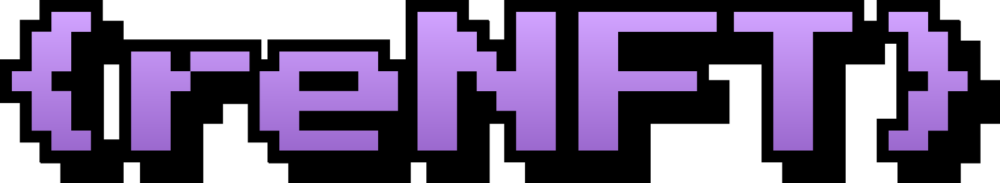

# subgraph-mooncat

To the MoonCat rescuers 🍾🥂

May your cats forever go to the MOON

HODL MOON RESCUERS

**With Love**

**ReNFT Fam**

## Strange Empirical Observations and Notes

- thegraphprotocol's dashboard is currently experiencing issues with showing correct logs. so you may deploy successfully and then have the build fail during indexing and not see any logs. in that case simply comment out everything but one handler in subgraph and continue debugging
- cats may not exist (definition: catRescued event emitted) during CatNamed, AdoptionOfferCreated, and other events. this can only mean that the graph is not indexing blocks linearly potentially? that would be extremely strange. not sure what exactly is going on here
  - juanmardefago |  Protofire — Today at 15:31
It's linear, but you might be missing a creation event somewhere (or maybe your creation event signature isn't exactly the same one as in the contracts)
[15:31]
or maybe in some weird case the naming event gets emitted before the creation event
[15:31]
seen that happen in some protocols
  
## Dos

- **NEVER ASSUME EXISTENCE OF AN OBJECT IN STORE. ALWAYS CREATE IF LOAD RETURNS NULL (when required, of course)**
